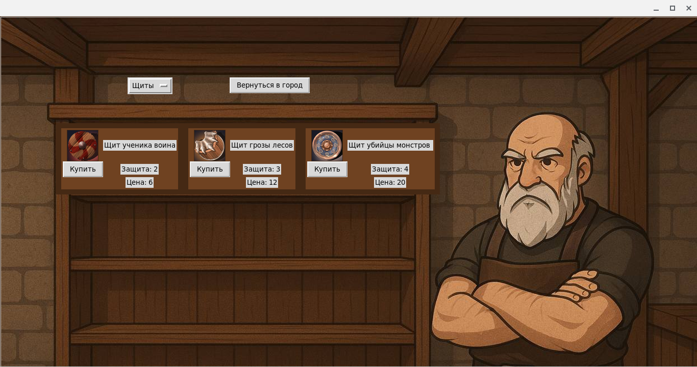

# combats_tkinter


CombatSkinter ist ein kleines, pädagogisches Spiel für Kinder, entwickelt mit Python und Tkinter.  
Der Spieler bekämpft Monster, indem er Mathematikaufgaben löst. Richtige Antworten verursachen Schaden am Gegner.  
Nach dem Sieg erhält der Spieler Erfahrungspunkte (XP) und Gold, um Ausrüstung zu kaufen und Charakterwerte zu verbessern.

---

## Funktionen
- Mathematische Aufgaben (Addition, Subtraktion, Multiplikation, Division)
- Rundenbasiertes Kampfsystem
- Erfahrungspunkte und Levelsystem
- Shop zum Kauf von Waffen und Rüstungen
- Speichern und Laden von Spielständen mit JSON-Dateien

---

## Screenshots




---

## Installation

### Voraussetzungen
- Python 3.10 oder neuer
- tkinter (in der Regel bereits in Python enthalten; unter Linux ggf. python3-tk installieren)

### Lokale Ausführung
```bash
git clone https://github.com/Mordvinov-ua/combats_tkinter.git
cd CombatSkinter
python -m venv venv
# macOS / Linux
source venv/bin/activate
# Windows
venv\Scripts\activate
pip install -r requirements.txt
python src/main.py
